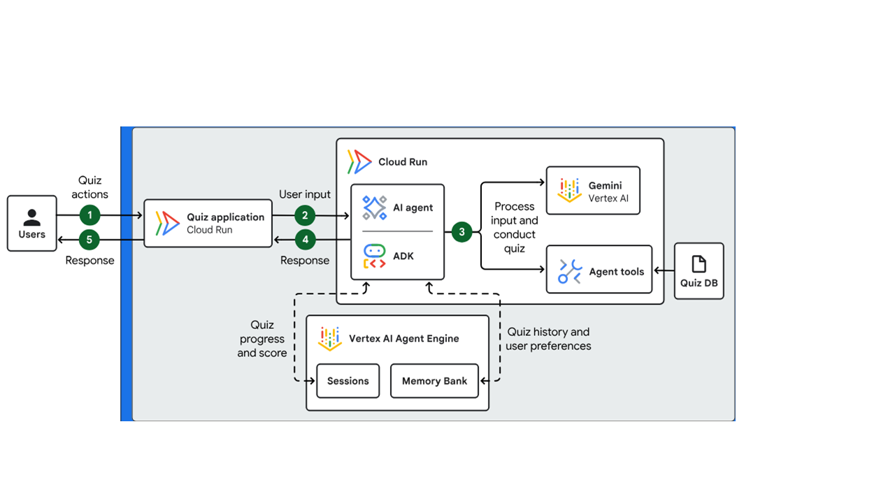

# Use Case Description
The use is to build an agent which administers interactive learning quiz with an agentic AI workflow. The agent assesses a user's knowledge on a specific topic 
and it uses a persistent session state and long-term memory to create a personalized experience. The agent maintains a history of the user's answers, which lets 
it dynamically adjust the difficulty and content of subsequent questions. 
# Architecture



## The architecture shows the following data flow:
1. A user performs an action, such as starting a quiz or submitting an answer, within the quiz application that is hosted on Cloud Run.
2. The application forwards the user's input to the AI agent.
3. The AI agent uses the Gemini model on Vertex AI to interpret the user's input. Based on the user's request, the agent calls the appropriate tools to perform the requested quiz action.
   For example, the agent selects a tool to start a quiz session, evaluate an answer, or generate the next question.
4. The agent sends the response to the quiz application.
5. The quiz application forwards the response to the user.

## To maintain the quiz's state and personalize the experience, the agent performs the following background tasks:
1. The agent appends the latest quiz progress and score to the history of the saved session that's stored in Vertex AI Agent Engine Sessions.
2. The agent transforms quiz data into memories and stores them in Memory Bank for long-term recall. The agent uses the historical data that's stored in memory to generate context-aware responses in future sessions.

## Technical stack
1. Cloud Run: A serverless compute platform that lets you run containers directly on top of Google's scalable infrastructure.
2. Agent Development Kit (ADK): A set of tools and libraries to develop, test, and deploy AI agents.
3. Vertex AI: An ML platform that lets you train and deploy ML models and AI applications, and customize LLMs for use in AI-powered applications.
4. Vertex AI Agent Engine Sessions: A persistent storage service that saves and retrieves the history of interactions between a user and agents.
5. Memory Bank: A persistent storage service that generates, refines, manages, and retrieves long-term memories based on a user's conversations with an agent.

```python
# Import the LlmAgent class from ADK — this is the core agent abstraction
from google.adk.agents import LlmAgent

# Import CallbackContext — used to pass state and context into callbacks
from google.adk.agents.callback_context import CallbackContext

# Import generic content types from Google GenAI SDK
from google.genai import types

# Optional typing support for better clarity in function signatures
from typing import Optional

# Import quiz-related tool functions (these are custom tools you expose to the agent)
from tools.tools import (
    get_quiz_questions,   # Fetch quiz questions
    start_quiz,           # Begin a new quiz session
    submit_answer,        # Submit an answer to the current question
    get_current_question, # Retrieve the current question
    get_quiz_status,      # Check quiz progress/status
    reset_quiz,           # Reset quiz state
)

# Import base prompt and quiz instructions — these define the agent’s behavior
from python_tutor_core.prompts import BASE_PROMPT, QUIZ_INSTRUCTIONS

# Utility function to initialize quiz state
from python_tutor_core.agent_utils import initialize_quiz_state


# -------------------------------
# Callback to initialize quiz state
# -------------------------------
# This function runs *before* the agent executes.
# It ensures that the quiz state is initialized in the agent’s context.
# Reference: https://google.github.io/adk-docs/callbacks/types-of-callbacks/#before-agent-callback
def before_agent_callback(callback_context: CallbackContext) -> Optional[types.Content]:
    """Initialize quiz state if not already present"""
    initialize_quiz_state(callback_context.state)
    return None


# -------------------------------
# Define the list of tools available to the agent
# -------------------------------
quiz_tools = [
    get_quiz_questions,
    start_quiz,
    submit_answer,
    get_current_question,
    get_quiz_status,
    reset_quiz,
]


# -------------------------------
# Root agent definition
# -------------------------------
# Create an LlmAgent with:
# - Model: Gemini 2.5 Flash (fast LLM for interactive tasks)
# - Name: Identifier for the agent instance
# - Instruction: Concatenation of base prompt + quiz instructions
# - Tools: The quiz functions defined above
# - Callback: The before_agent_callback to set up state
root_agent = LlmAgent(
    model="gemini-2.5-flash",
    name="python_tutor_short_term",
    instruction=BASE_PROMPT + QUIZ_INSTRUCTIONS,
    tools=quiz_tools,
    before_agent_callback=before_agent_callback,
)
```
